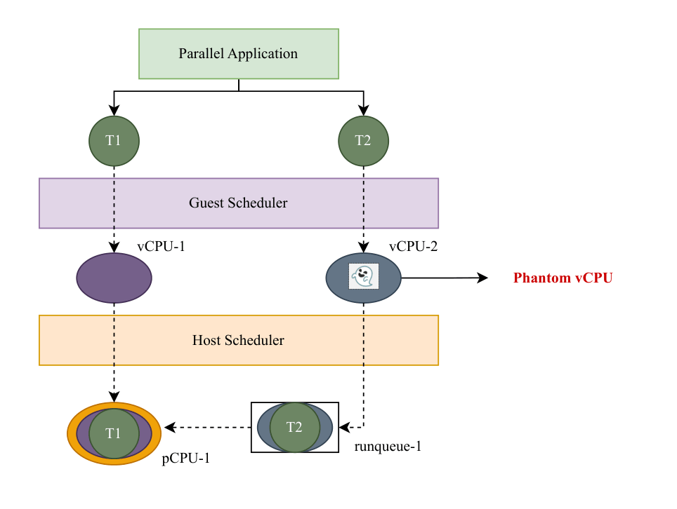
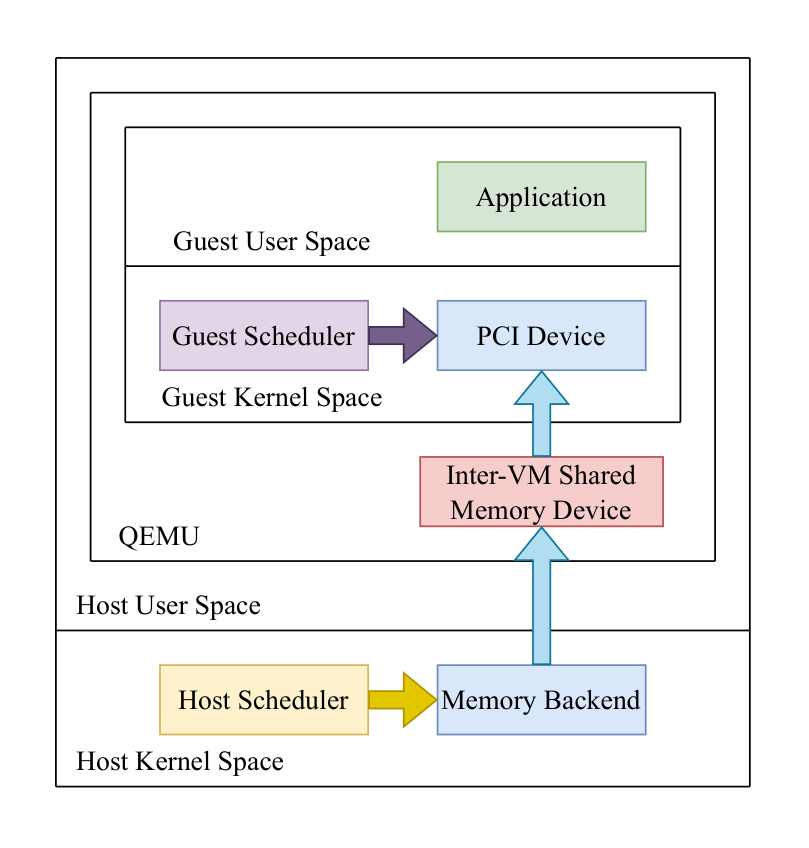

# Phantom Tracker

  

Oversubscription is a popular cost-cutting practice in cloud deployments, which leads to the phenomenon of untimely vCPU preemptions. As presented in this thesis [1], a phantom vCPU is such a preempted vCPU which is currently waiting in the runqueue of a pCPU on the host, and as a consequence, the thread running on it inside the guest is now stalled. Phantom Tracker is an algorithmic solution that leverages eBPF and paravirtualized task scheduling to detect and quantify such phantom vCPUs accurately.

  

This implementation is part of a GSoC Project [2] that targets QEMU/KVM virtual machines, uses ivshmem-plain device [3] for facilitating the paravirtualized task scheduling related communication, and provides integration tools for using Phantom Tracker with libgomp, i.e. GCC's implementation of OpenMP.

## References
[1] https://inria.hal.science/tel-05438117v2

[2] https://gcc.gnu.org/wiki/SummerOfCode#OMP_DYNAMIC_POLICY

[3] https://www.qemu.org/docs/master/system/devices/ivshmem.html
